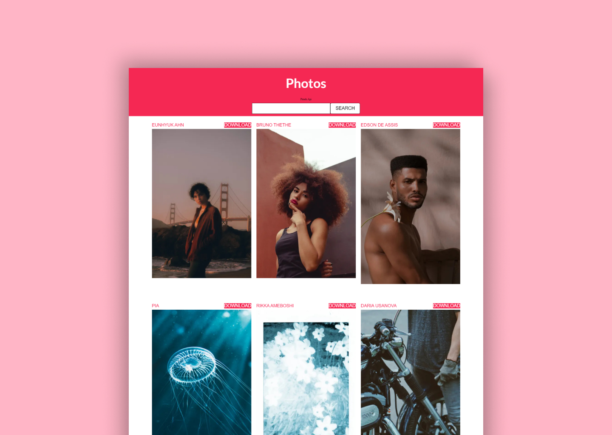
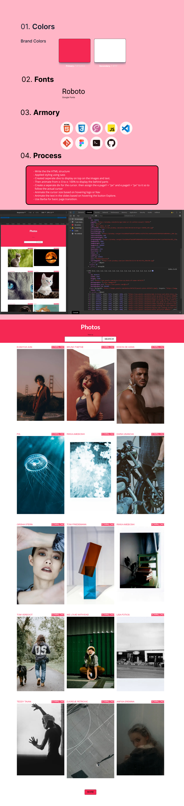

<br />
<p align="center">
  <a href="https://m90khan.github.io/Photos-Pexels-Pix-api/">
    
  </a>

  <h3 align="center">Unsplash/Pixbay/Pexels Clone</h3>

  <p align="center">
Fetching Data from Pexels and PixBay API's and displaying them <br />
    <a href="m90khan@gmail.com"><strong>Contact Me</strong></a>
    <br />
    <br />
    <a href="https://m90khan.github.io/Photos-Pexels-Pix-api/">View Demo</a>
    
   </p>
</p>

## Table of Contents

- [About the Project](#about-the-project)
- [Process](#process)
- [Skills](#skills)
- [Code Snippet](#code)
- [Contact](#Contact)

---

### About the Project

- Fetching Data from Pexels and PixBay API's and displaying them.

Live: https://m90khan.github.io/Photos-Pexels-Pix-api/


#### Process

- Write the the HTML structure
- Applied styling using sass
- Fetch data from the API Pexels and Pixbay
- take the images, urls and create display them on the front-end
- another thing that can be done is to store thee enrated div and based on selection we store them to localStorage . Wishlist Functionality

## 

### Skills

[][youtube]
[][youtube]
[][youtube]
[][youtube]
[][youtube]

[][youtube]
[][youtube]
[][youtube]
<br />
<br />

---

### Code Snippet

```javascript
async function fetchApi(url) {
  const datapexel = await fetch(url, {
    //method tell us what we want to do with the data
    method: 'GET',
    headers: {
      Accept: 'application/json',
      Authorization: authPexels,
    },
  });
  const data = await datapexel.json();
  console.log(data.photos);
  return data;
}

function generatePictures(data) {
  data.photos.forEach((photo) => {
    const galleryImg = document.createElement('div');
    galleryImg.classList.add('gallery__img');
    galleryImg.innerHTML = `
    <div class="gallery__info  "><p class="btn"><a href="${photo.photographer_url}"target="_blank"  >${photo.photographer}</a></p> 
    <a href=${photo.src.original} class="btn btn--secondary" target="_blank">Download</a></div> `;
    gallery.appendChild(galleryImg);
  });
}
```

---

### Connect with me:

[][youtube]

[][twitter]
[][linkedin]
[][instagram]
[][behance]
[][dribble]
<br />

---

[youtube]: https://www.youtube.com/channel/UC96rVfdTKsjZpREnH6CaCOw
[twitter]: https://twitter.com/m90khan
[linkedin]: https://www.linkedin.com/in/uxdkhan
[instagram]: https://www.instagram.com/uxd.khan/
[behance]: https://www.behance.net/Khan_Mohsin
[dribble]: https://dribbble.com/uxdkhan
